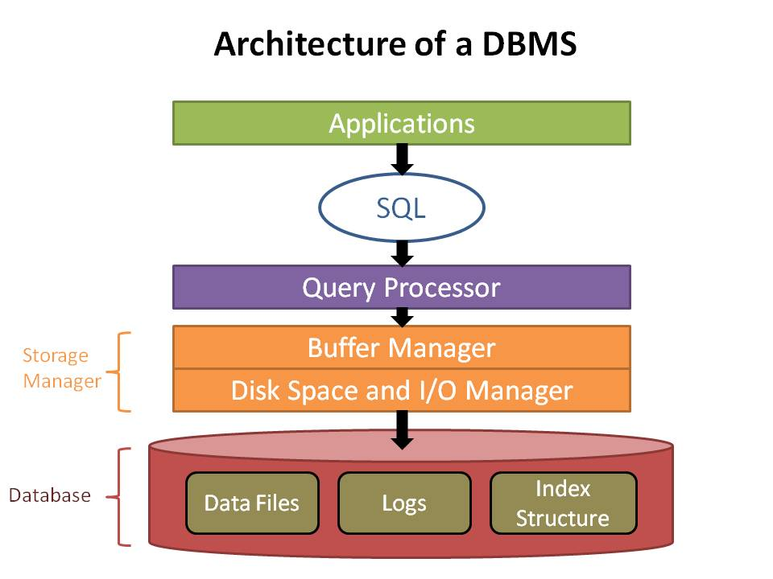

class: center, middle

# Databases

---

## Goals

- understand databases (w/o being too mathy)
- connect (relational) databases to the set theory and functions
- understand the purpose of models

---
layout: true

## Where are we?

---

<div class="mermaid">
graph TD
Controller --- Model
Controller --- View
Model --- Database((Database))
</div>

---

<div class="mermaid">
graph TD
Controller --- Model
Controller --- View
Model --- Database((Database))
style Database stroke:#333,stroke-width:4px;
</div>

---

layout: false

## What is a Database?

--

.center.larger[Structured Collection of Data]


---

## Parts of a Database


### .center[Data]

--

### .center[Structure]

.center.larger[Its structure is called a **Schema**]

---

## Examples of Databases?

.larger[
- contact list
- keyboard
- a song playlist
]

--

.center[Other examples?]

---

## Database Transactions

.larger[Databases generally offer ways to:]

- **C**reate
- **R**ead
- **U**pdate
- **D**elete

--

.center[Somehow we need to ensure database transactions happen reliably]

---

## Database Transactions

.center.larger[How do you prioritize simultaneous requests to create, read, update and delete??]

--

.center.larger[Answer: ACID]

---

## Enter: ACID

- **A**tomicity (all or nothing)

--

- **C**onsistency (executing rules ensures valid states)

--

- **I**solation (no interference between transactions)

--

- **D**urability (data should always be safe, even during failures/crashes)

---

## ACID: Atomicity

.center[Ensures an operation is uninterruptable]

--

### .center[Example]

Buying a theater ticket.

--

You get both a seat and ticket.

---

## ACID: Consistency

.center[Calling a function with the same input multiples times, **must** yield the same output, everytime]

--

### .center[Example]

if `a` is `1` and `b` is `2`, this function returns 3 everytime

```javascript
function add(a, b) {
  return a+b;
}

```

---

## ACID: Isolation


.center[Two transactions **must** not interfere with one another]

--

### .center[Example]

You order a drink and burger from Steak 'n Shake.

--

A messed up burger doesn't mean your drink is also messed up.

---

## ACID: Durability 

.center[**must** be able to revert back to a last known good state]

--

### .center[Example]

Your Browser crashes unexpectantly, THEN...

--

On restart it asks you if you want to restore your open browser tabs

---

## Families of Databases


--

.center.larger[Database = Structured Collection of Data]

--

.center.larger[Databases are grouped based on their effective "structure"]


---

## Database Families

- Relational

--

- Document Store/NOSQL

--

- Columnar

--

- Graph

---

## Database Families: Document Store

.center.larger[One document per entry]

--

### .center[Who uses it]

.center[Verizon Wireless]

---

## Database Families: Columnar

.center.larger[Data is in tables]

--

### .center[Who uses it]

.center[Amazon]

---

## Database Families: Graph

.center.larger[Trees of Trees; Models Human Realtionships]

--

### .center[Who uses it]

.center[Facebook]

.center[Google]

---

## Database Families: Relational

.center.larger[Data is in tables]

--

### .center[Who uses it]

.center[Eventbrite]
.center[Vanderbilt Hospital]

---

## Architecture


.center.fill[]
